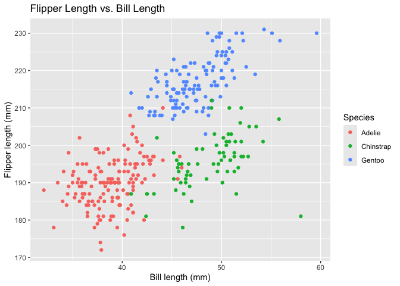

Homework1
================
Yiran Jin
2026-09-24

# Problem 1

``` r
library(tidyverse)
data("penguins", package = "palmerpenguins")
```

## Description of the Penguins Dataset

The `penguins` dataset contains data on penguins from the Palmer
Archipelago. There are important variables include `species`, which
identifies the penguin species (Adelie, Chinstrap, and Gentoo),
`island`, which identifies the island (Biscoe, Dream, and Torgersen),
`bill_length_mm` and `bill_depth_mm`, which measure bill dimensions,
`flipper_length_mm`, which measures flipper length in millimeters, and
`body_mass_g`, which measures body mass in grams.

The dataset contains 344 rows and 8 columns. The mean flipper length is
200.9152047 mm.

## Scatter Plot for Penguins

``` r
ggplot(
  penguins,
  aes(
    x = bill_length_mm,
    y = flipper_length_mm,
    color = species
  )
) +
  geom_point() +
  labs(
    x = "Bill length (mm)",
    y = "Flipper length (mm)",
    color = "Species",
    title = "Flipper Length vs. Bill Length"
  )
```

<!-- -->

``` r
ggsave(
  "penguins_scatterplot.png",
  width = 7,
  height = 5
)
```

# Problem 2

``` r
library(tidyverse)

set.seed(123)

# Create the data frame
mydataframe_df <- tibble(
  norm_samp = rnorm(10),
  norm_samp_pos = norm_samp > 0,
  character_var = c(
    "a", "b", "c", "d", "e",
    "f", "g", "h", "i", "j"
  ),
  factor_var = factor(
    c("low", "medium", "high", "low", "medium", "high", "low", "medium", "high", "low"
    )
  )
)
```

## Take the mean of each variable

``` r
mean(pull(mydataframe_df, norm_samp))
```

    ## [1] 0.07462564

``` r
mean(pull(mydataframe_df, norm_samp_pos))
```

    ## [1] 0.5

``` r
mean(pull(mydataframe_df, character_var))
```

    ## [1] NA

``` r
mean(pull(mydataframe_df, factor_var))
```

    ## [1] NA

``` r
as.numeric(pull(mydataframe_df, norm_samp_pos))
as.numeric(pull(mydataframe_df, character_var))
as.numeric(pull(mydataframe_df, factor_var))
```

The mean works for the numeric and logical variables, but it does not
work for the character and factor variables. R treats TRUE as 1 and
FALSE as 0, so the mean of the logical variable can be calculated.
Converting the logical variable to numeric gives 1s and 0s. The
character variable cannot be converted to numeric because it contains
text and the factor variable is converted to its internal level codes
rather than meaningful numerical values.
